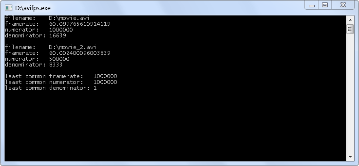

# avifps
A tool that reads AVI files you drop onto it, reports their framerates, and calculates framerate that they will have in common if you multiply their framerates by some integers. Basically calculates the least common multiple of their framerates taken as fractions (numerator / denominator).

